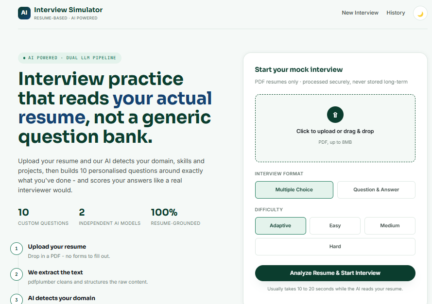
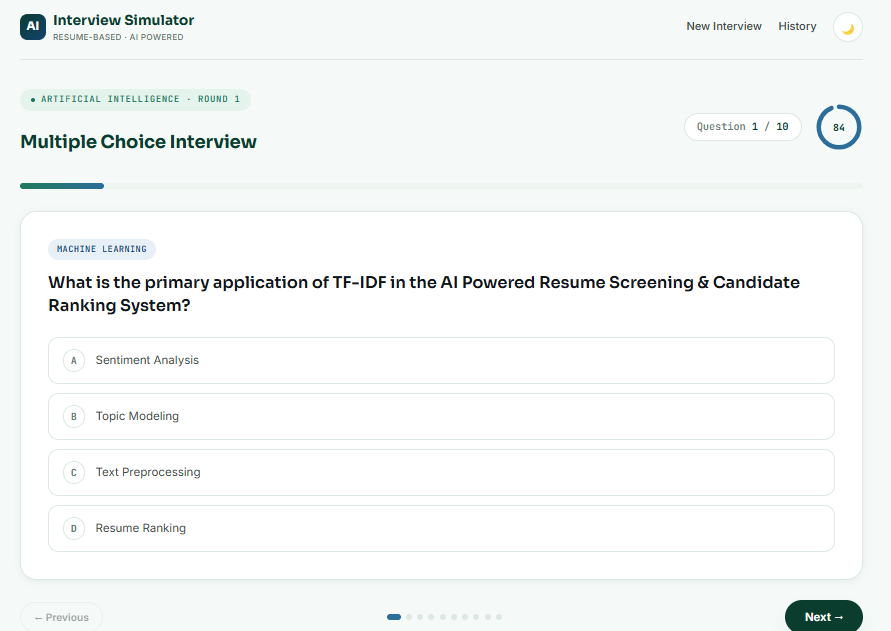
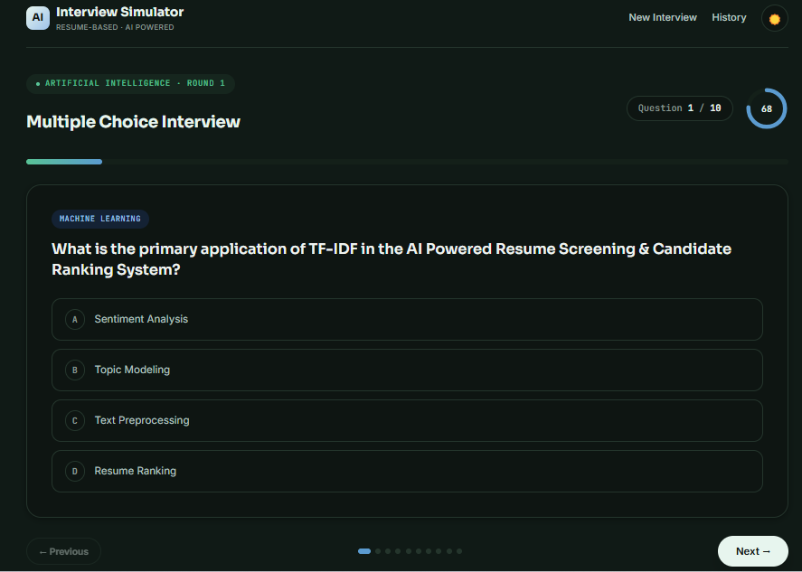
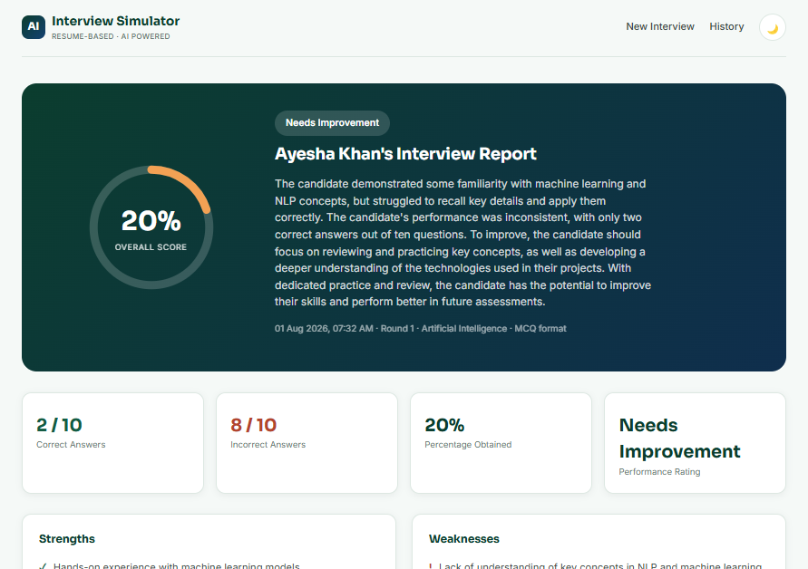
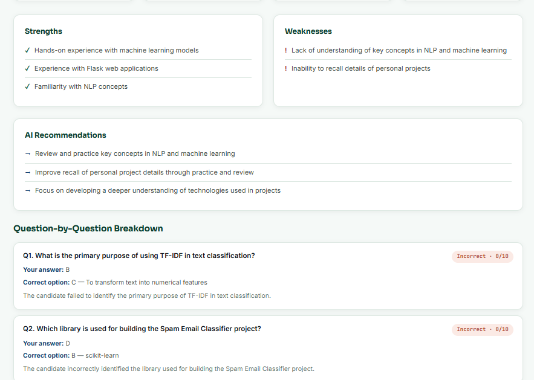
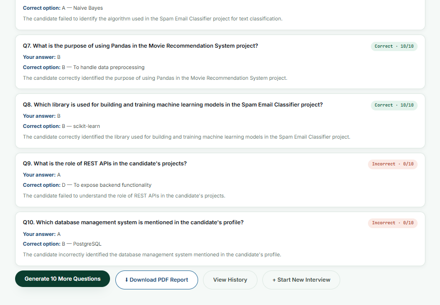

# AI Resume-Based Interview Simulator

An AI-powered interview simulator that reads an uploaded resume, detects the candidate's domain, skills, and projects, generates ten personalized interview questions using Groq large language models, runs a timed mock interview, and evaluates the candidate's answers through an independent AI evaluation pipeline. The result is a full performance dashboard with scores, strengths, weaknesses, and actionable recommendations.

---

## Table of Contents

- [Screenshots](#screenshots)
- [Overview](#overview)
- [Features](#features)
- [Technology Stack](#technology-stack)
- [Architecture](#architecture)
- [Project Structure](#project-structure)
- [Setup Instructions](#setup-instructions)
- [Usage Flow](#usage-flow)
- [Two-Model Architecture](#two-model-architecture)
- [Configuration Notes](#configuration-notes)
- [License](#license)

---

## Screenshots

### Landing Page - Resume Upload and Configuration

The landing page introduces the application, outlines the eight-step workflow, and lets the candidate upload a resume and choose an interview format and difficulty level. The candidate uploads a PDF resume, selects between Multiple Choice or Question and Answer format, and picks a difficulty level before starting the interview.



### Interview in Progress - Multiple Choice Mode and Question Answer Mode

The interview screen shows a live progress bar, a question counter, a per-question countdown timer, and the current question with four selectable options. In Question and Answer format, the candidate types a free-text response for each question, evaluated later against an AI-generated expected answer.






### Performance Dashboard

After submission, the AI evaluator produces an overall score, a performance rating, correct and incorrect counts, strengths, weaknesses, and personalized recommendations.







---

## Overview

The objective of this project is to simulate a realistic technical interview grounded entirely in the candidate's own resume, rather than a generic question bank. The application extracts resume text, identifies the candidate's domain and technical background, generates ten resume-specific interview questions, administers a timed interview, and scores the candidate's responses with detailed, constructive feedback.

## Features

- Resume upload and parsing from PDF using pdfplumber, with a PyPDF2 fallback for unusual PDF structures.
- Automatic domain detection, skill extraction, and project identification from resume content.
- Two independent Groq-powered pipelines, one for question generation and one for answer evaluation.
- Two interview formats: Multiple Choice and Question and Answer.
- Adjustable difficulty levels: Easy, Medium, Hard, and Adaptive.
- Live interview interface with a progress bar, question counter, and a per-question countdown timer.
- Deterministic, code-based correctness checking for Multiple Choice questions, so scoring is always accurate regardless of what the AI evaluator's narrative text says.
- AI-judged correctness for free-text Question and Answer responses, compared against a model-generated expected answer.
- A full performance dashboard: overall score, performance rating, correct and incorrect counts, strengths, weaknesses, recommendations, and a per-question breakdown.
- A "Generate 10 More Questions" feature that produces a fresh, non-repeating round based on the same resume profile.
- A downloadable PDF report of the interview results.
- Session-based interview history for tracking previous attempts.
- Light and dark themes across the entire application.
- Server-side session storage, so no answer keys or resume data are ever exposed to the browser.

## Technology Stack

| Technology | Purpose |
|---|---|
| Python | Backend development |
| Flask | Web framework |
| Flask-Session | Server-side session storage |
| Groq API | AI question generation and answer evaluation |
| pdfplumber / PyPDF2 | Resume parsing |
| ReportLab | PDF report generation |
| HTML5 | Frontend structure |
| CSS3 | Responsive styling and theming |
| JavaScript | Client-side interaction (timer, progress, navigation) |

## Architecture

```
Browser
   |
   v
Flask routes (app.py)
   |
   |--> resume_parser.py        Extracts and cleans text from an uploaded PDF
   |
   |--> groq_service.py
   |      |--> analyze_resume()        Model 1a: domain, skills, projects, technologies
   |      |--> generate_questions()    Model 1b: ten resume-grounded interview questions
   |      \--> evaluate_answers()      Model 2:  scoring and AI feedback
   |
   \--> Flask-Session (server-side)    Stores profile, questions, and results between requests
```

Correctness for Multiple Choice questions is calculated directly in Python by comparing the candidate's selected option to the correct option. The Groq evaluator is used only to generate qualitative feedback, strengths, weaknesses, and recommendations around scores that are already final. This keeps the scoring transparent and consistent, while still using AI for the parts that genuinely require judgment, such as grading free-text answers in Question and Answer mode.

Interview data, including resume text, generated questions, and correct answers, is kept entirely server-side using Flask-Session. The browser only ever receives a small, signed session identifier, not the underlying data, so answer keys are never exposed to the candidate before submission.

## Project Structure

```
interview-simulator/
    app.py                    Flask routes and application logic
    groq_service.py           Groq API pipelines: question generation and evaluation
    resume_parser.py          PDF text extraction and cleaning
    requirements.txt
    .env                     Copy to .env and add your Groq API key
    .gitignore
    sample_resume/
        sample_resume.pdf     Sample resume for testing
    templates/
        base.html
        index.html            Landing and upload page
        interview.html        Live interview interface
        results.html          Performance dashboard
        history.html          Session interview history
    static/
        css/
            style.css         Design system, light and dark themes
        js/
            main.js           Upload page interactions
            interview.js      Timer, progress, navigation, submission
            theme.js          Dark mode toggle
        img/
            favicon.svg, favicon.ico, apple-touch-icon.png
            m1.png - m6.png   Application screenshots
```

## Setup Instructions

Requirements: Python 3.13, a free Groq API key from https://console.groq.com/keys, and an editor such as VS Code.

1. Clone the repository and open the project folder.

   ```powershell
   git clone https://github.com/thehmfpk/ai-resume-interview-simulator.git
   cd ai-resume-interview-simulator
   ```

2. Create and activate a virtual environment.

   ```powershell
   python -m venv venv
   venv\Scripts\activate
   ```

   On macOS or Linux:

   ```bash
   python -m venv venv
   source venv/bin/activate
   ```

3. Install dependencies.

   ```bash
   pip install -r requirements.txt
   ```

4. Configure your Groq API key.

   Make `.env` and set your key:

   ```
   GROQ_API_KEY=your_real_groq_api_key
   ```

5. Run the application.

   ```bash
   python app.py
   ```

6. Open the application at `http://127.0.0.1:5000`.

7. Upload the included `sample_resume/sample_resume.pdf`, or your own PDF resume, to try the full flow.

## Usage Flow

1. Upload a resume in PDF format on the landing page.
2. Choose an interview format, Multiple Choice or Question and Answer, and a difficulty level.
3. The application extracts the resume text, detects the candidate's domain and skills, and generates ten questions grounded in that content.
4. The candidate answers each question within the interview interface, guided by a progress bar, question counter, and countdown timer.
5. On the final question, the candidate submits the interview, and the AI evaluator scores each response.
6. The performance dashboard displays the overall score, rating, strengths, weaknesses, recommendations, and a full question-by-question breakdown.
7. The candidate may generate ten additional, non-repeating questions, download a PDF report, or review past attempts in the history page.

## Two-Model Architecture

| | Model 1 - Question Generator | Model 2 - Evaluator |
|---|---|---|
| Functions | `analyze_resume()`, `generate_questions()` | `evaluate_answers()` |
| Input | Raw resume text | Candidate profile, questions, and submitted answers |
| Output | Domain, skills, projects, and ten interview questions | Per-question correctness and score, strengths, weaknesses, recommendations, overall score |
| Correctness logic | Not applicable | Deterministic exact-match scoring for Multiple Choice; AI judgment for Question and Answer |

Both pipelines call the Groq chat completions API independently. Either pipeline's prompt or underlying model can be changed without affecting the other, which satisfies the modular, two-pipeline architecture required by the assignment.

## Configuration Notes

- `GROQ_MODEL` in `.env` defaults to `llama-3.3-70b-versatile` and can be changed to any chat-completion-capable Groq model.
- The maximum resume upload size is 8 MB, and only PDF files are accepted.
- Session data, including resume text, questions, and results, is stored server-side in a `.flask_session` directory. This directory is excluded from version control.
- The `.env` file containing the real API key is excluded from version control through `.gitignore` and should never be committed.

## Author

**Name:** Hafiz Muhammad Faizan

**Email:** thehmfpk@gmail.com

**Website:** www.hafizmfaizan.site

**LinkedIn:** https://www.linkedin.com/in/hafizmfaizan/
